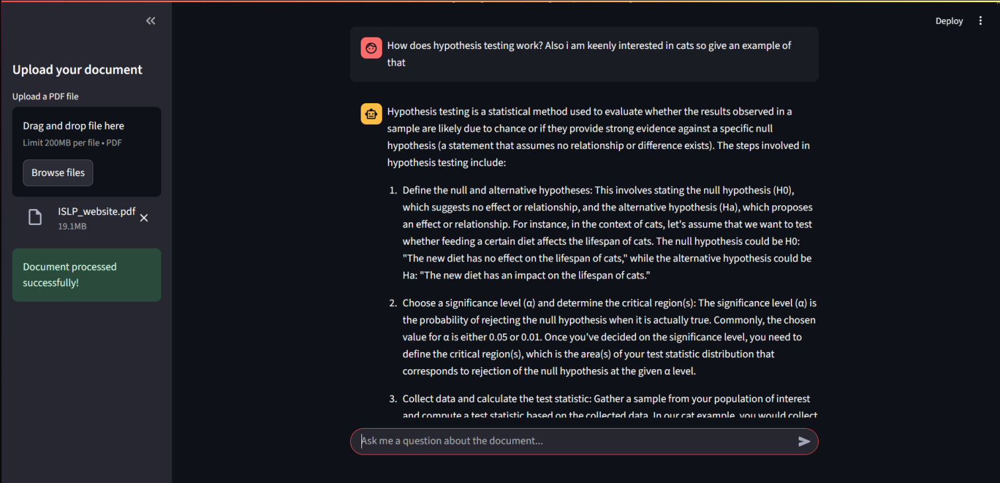

# Simple RAG Application

This is a simple, modularized RAG (Retrieval-Augmented Generation) application that uses LangChain and Ollama to answer questions about a document.

---

## Streamlit UI



## Features

- **Document Upload:** Upload your own PDF documents directly through the Streamlit UI.
- **Streamlit UI:** Interactive and user-friendly interface for chatting with your documents.
- **Modular Design:** The code is separated into modules for configuration, data loading, and chat logic.
- **Extensible:** Easily add new data sources or change the LLM model.
- **History-Aware:** The chatbot remembers the conversation history to answer follow-up questions.

## Getting Started

### Prerequisites

- Python 3.7+
- Ollama (and a downloaded model like `mistral:instruct`)

### Installation

1. **Clone the repository:**

   ```bash
   git clone https://github.com/Ibrahim-Kiani/RAG-Document-reader.git
   cd RAG-Document-reader
   ```

2. **Install the dependencies:**

   ```bash
   pip install -r requirements.txt
   ```

3. **Start the Ollama server:**

   ```bash
   ollama serve
   ```

### Usage

To start the Streamlit application, run the following command:

```bash
streamlit run app/streamlit_app.py
```

Open your web browser and navigate to the address provided by Streamlit (usually `http://localhost:8501`). You can then upload a PDF document and start asking questions.

## Project Structure

```
.gitignore
app/
    __init__.py
    chat.py
    config.py
    data_loader.py
    streamlit_app.py
rag_db/
    ...
README.md
requirements.txt
```

- **`app/`**: Contains the core application logic.
  - **`streamlit_app.py`**: The main Streamlit application file.
  - **`config.py`**: Stores configuration variables.
  - **`data_loader.py`**: Handles loading and processing the data.
  - **`chat.py`**: Manages the chat logic and RAG chain.
- **`requirements.txt`**: Lists the Python dependencies.
- **`rag_db/`**: The directory where the Chroma vector database is stored.

## Customization

- **Change the LLM:** Modify the `LLM_MODEL` variable in `app/config.py`.
- **Adjust the chunking strategy:** Modify the `CHUNK_SIZE` and `CHUNK_OVERLAP` variables in `app/config.py`.
